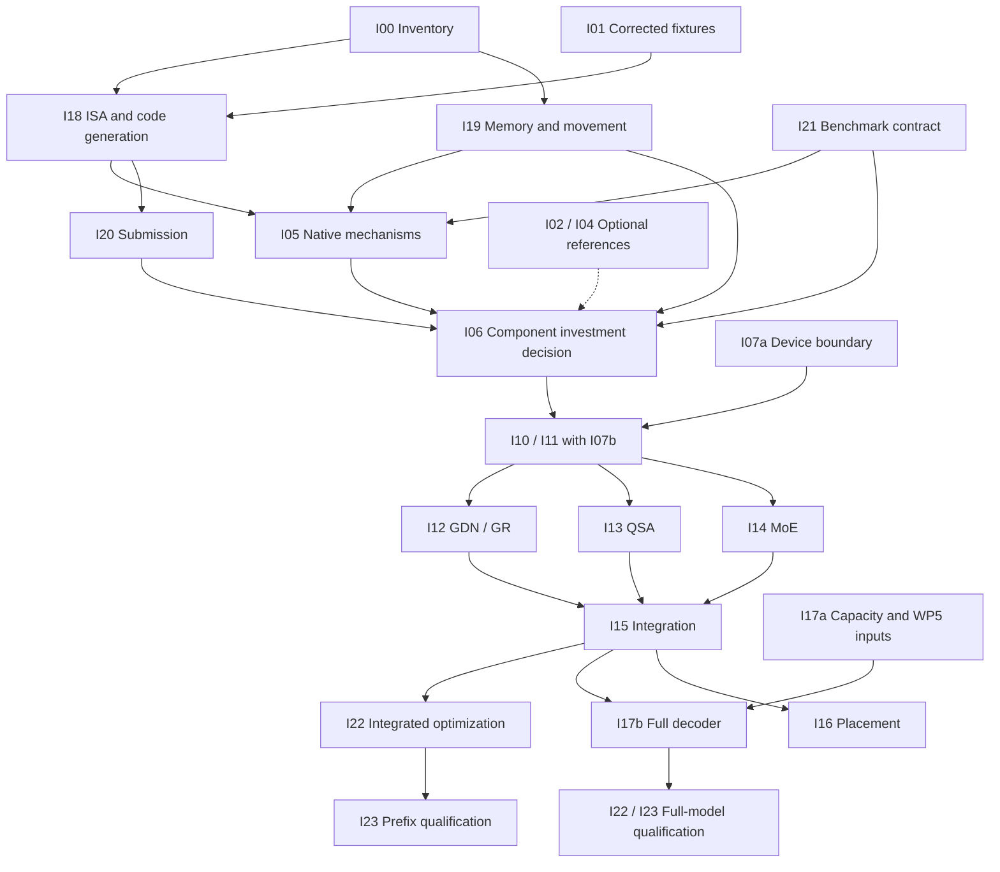

# Intel iGPU and backend restructuring work packages

Date: 2026-09-08. **Reconciled with `220afaf`; research and conditional implementation plan.**
User priority: interactive inference first, training later.
Read [the platform research and design](INTEL_IGPU_BACKEND_DESIGN.md) for evidence, architecture,
ownership, benchmark protocol and selection criteria. The [whole-plan review](INTEL_IGPU_PLAN_REVIEW.md)
records scope gaps and their closure; the [benchmark and optimization contract](INTEL_IGPU_PERFORMANCE.md)
is normative for all measured packages.

## Groundwork branch checkpoint

On `research/intel-groundwork`, [initial results](INTEL_IGPU_GROUNDWORK_RESULTS.md) establish installed
SDK/runtime visibility, two-size mapped staging and SYCL/oneDNN interoperability, plus ten dense
projection shapes and a bounded three-mode USM benchmark. These are partial I00/S0/S1/I05/I19/I21
inputs. I06 is not passed. Direct Level Zero submission, real IQ formats, sparse/recurrent chains and
sustainable capacity remain open. The report and raw manifests take precedence over earlier unknown
hardware/tooling statements for this exact runtime tuple; main engine qualification is unchanged.

## Scope and execution rules

The deliverable is a measured decision and, only if justified, a useful Intel inference path with
maintainable backend boundaries. Sub0Llm retains execution ownership. Intel-native kernel generation
(SYCL/ESIMD initially) and Level Zero versus SYCL submission are the primary experiments. OpenVINO
and llama.cpp are optional bounded comparisons; Vulkan is parked. See the
[ISA, quantization and memory study](INTEL_IGPU_ISA_MEMORY_RESEARCH.md) for I18–I20's evidence and probes.

Code preparation can run in parallel; **hardware measurements on this laptop are serialized**.
Check [ACTIVE_WORK_LOG.md](ACTIVE_WORK_LOG.md) before touching shared files or consuming the CPU/GPU.
WP4f's converter correction merged in `296f2a1`; freeze its corrected fixtures and precision metadata.
Claude owns active WP5a tokenizer and WP5b mmap/full-scale transplant work; consume their results
without editing their tools or `moe_quant.hpp`. Copilot owns active I08/I09 extraction.

Each package gets its own result/report directory and explicit file ownership. In the shared working
tree, one integration owner edits root CMake, generated-config emitters and public headers. Other
tracks prepare concrete changes to their own leaf directories; do not concurrently patch a monolith.
Keep downloads, SDK staging, model conversion and output in isolated paths. Never regenerate the
tokenizer/corpus or overwrite live WP4 artifacts as part of a backend experiment.

Effort bands below are **planning estimates**, not commitments: S roughly 0.5–2 engineer-days,
M 2–5, L 5–10, XL requires a new estimate after the preceding gate. Device/compiler problems and
reference-fidelity defects can dominate these estimates. Do not sum all conditional branches as an
approved project estimate.

## Package map

| ID | Deliverable / current status | Dependencies | Estimate |
|---|---|---|---|
| I00 | Runtime inventory; registry identity known, execution unverified | None | S |
| I01 | Correctness manifest; merged WP4f correction is input | Corrected fixtures and precision census | M |
| I02 | Optional llama.cpp SYCL reference | I00, I01 for exact target | M |
| I03 | Vulkan comparison — parked | Evidence to reopen, then I00/I01 | Deferred |
| I04 | Optional bounded OpenVINO comparison | I00, I01 | M |
| I05 | Native dense/GDN/encoded-expert experiment | I00/I01, initial I18/I19 findings | M |
| I06 | Component-based investment decision; not final interactive acceptance | I05, I18–I21; optional I02/I04 evidence | S |
| I07 | Device ABI/build axis; not delivered by source moves | I01; I07b lands with I11 | M |
| I08 | CPU extraction — area, manifest and API facade landed; deeper split active | Frozen baseline, coordinate Copilot | M remaining |
| I09 | CUDA extraction — area and manifest landed; deeper split active | CUDA baseline, coordinate Copilot/I07 | L remaining |
| I10 | Encoded-weight preparation and memory accounting | I01/I06, I19, coordinate I07/I11 | L |
| I11 | Native context and dense generation consumer | I06, I07a; land I07b together | L |
| I12 | GDN and gated residual | I11, I01 | L |
| I13 | QSA | I11, I01 | L |
| I14 | Encoded MoE | I10/I11, I18 | L |
| I15 | Integrated prefix correctness and baseline performance | I10–I14, I21; I08 only where needed | L |
| I16 | CPU/iGPU/NVIDIA placement | I15 or equivalent working experiment; I19 | XL |
| I17 | I17a full-model capacity, I17b useful decoder; I17c–e deferred features | I17a: I01/I19 + WP5b; I17b: I15/I17a + WP5a | XL, split below |
| I18 | ISA/code-generation and quantization proof | I00, I01 for real planes | M |
| I19 | Memory access, residency and bounded staging | I00; WP5b findings as available | M |
| I20 | Equivalent-kernel Level Zero/SYCL submission comparison | I00, executable I18 kernel; coordinate I19 | M |
| I21 | Persistent benchmark harness and regression records | I00/I01 schemas; grow with runnable consumers | M |
| I22 | Measured native optimization campaign | I21 + correct component; integrated acceptance after I15 | L, bounded per hypothesis |
| I23 | Runtime/deployment qualification and release decision | I07b/I11 smoke; prefix after I15/I22; full after I17b | M |

I07–I09 remain independently useful maintenance. They do not block engine-free research, and a
complete CUDA split is not required for Intel inference. I08/I09 delivery so far is structural;
full runtime parity/performance gates remain outstanding in the active owner's log. Do not repeat
committed moves or infer that a source manifest implements multi-toolchain orchestration.

## Preliminary spikes and plan evolution

These are bounded sub-deliverables of existing packages, not another backend or a second experiment
framework. Estimates below exclude environment setup; I00 reports that cost separately. Reserve the
laptop before execution. Failed/unsupported outcomes are useful results, provided the reason is
reproducible. Preparation can proceed in parallel in the named leaf directories.

| Spike / owner package | Question and smallest useful experiment | Initial bound | Decision / next consumer |
|---|---|---|---|
| S0 / I00, I20 | Can a checked compiler-produced kernel execute through the proposed native route, and can one selected library primitive share its allocations and synchronization? Test one buffer handoff both directions; compare an explicit-copy fallback | 1–2 days | I06/I11 choose a compatible compiler/runtime/context recipe; direct Level Zero may remain conditional if library interop is costly or unsupported |
| S1 / I19 | Can the actual mapped-file allocation type be legally accessed/imported, or must selected encoded ranges be staged? Touch bounded representative ranges and verify CPU-write/GPU-read synchronization | 1 day | I10 chooses mapping lifetime, staging and unique-byte accounting; no giant capacity sweep until this works |
| S2 / I18 | Which real IQ decode-dot route suits this GPU? One non-square gate/up/down triple with actual codebook/scales and M=1 plus prefill | 2 days | I05/I14 choose float fusion, bounded tile decode or a separately quality-gated integer-dot route; disprove unsupported matrix assumptions early |
| S3 / I20 | Can repeated dependent work update expert indices/arguments without costly recapture or unsafe buffer reuse? Replay two deliberately different routing patterns and a reset | 1 day | I11/I15 choose command/graph reuse and invalidation; ordinary submissions remain a valid baseline |
| S4 / I05 | Do omitted QSA/GR/host boundaries dominate the promising GEMV/GDN results? Use real component fixtures in a representative dependency chain, including index selection, state updates and final-logit transfer | 2 days | I06 ranks missing kernels and transfer bottlenecks before authorizing full integration; label partial chain coverage, never synthetic TTFT |
| S5 / I17a | Does a measured bounded working set plus the real artifact census leave a credible full-model memory path? Ingest WP5b facts; test one bounded selected-expert cache, without repeating the full transplant | 1 day after inputs exist | Continue full-model design, require explicit tiering work, or record infeasibility; prefix research can continue with a narrower claim |

S0/S1 come before large native implementation commitments. S2/S3 supply I05; S4 is required before
I06 claims coverage of the architecture's main bottlenecks. S5 starts as soon as its inputs exist and
runs independently of prefix integration. A spike may close from already-recorded equivalent evidence;
link that evidence instead of rebuilding scaffolding. A time bound ending without an answer produces
an inconclusive report and a costed follow-up, not automatic promotion.

Each spike leaves a compact evidence card: hypothesis, exact input/toolchain identity, commands,
correctness result, raw measurements/limitations, alternatives ruled out, recommended plan diff,
consumer package and remaining uncertainty. I21 stores the common schema. Keep benchmark utilities
only when they have ongoing measurement consumers; gate retired duplicate spike scaffolding under the
existing opt-in build options, consistent with AGENTS §11. Do not land unconsumed production knobs.

Review checkpoints are explicit work within I06/I21/I23, not a new permanent review subsystem:

1. **R0 after I00/S0/S1:** revise hardware facts, toolchain feasibility, allocation assumptions and
   outstanding risks. Resolve shared file ownership and harness interfaces before parallel code work.
2. **R1 after S2–S4, with S5 status:** I06 records proceed / narrow / defer / stop for each lane;
   revise dependencies, estimates, math/memory/submission recipe and the full-model capacity outlook.
3. **R2 before I11/I10 public wiring:** review the concrete consumed ABI, ownership, state machine,
   layouts and build boundary using cpp-review. I07b/I11 land together; I10's encoded interface remains
   private until I15 consumes it. Stop interface work on unresolved ownership or dependency cycles.
4. **R3 after I15's correct baseline:** reprioritize I22 from the measured critical path, freeze the
   optimization budget and re-evaluate whether the projected full-model path remains useful.
5. **R4 after I22/I17b evidence:** I23 records the exact qualification level and outstanding limits;
   update the main design, package map, performance baseline and active log together.

A changed artifact, driver/compiler, supported instruction, memory envelope or quality assumption
reopens only affected gates; record the prior decision, new evidence and impacted packages. Keep stable
IDs, mark superseded recipes explicitly, and distinguish planned / active / implemented-unqualified /
qualified / deferred status. Do not mark a package done merely because its source was committed.

## Wave 1: establish evidence without engine changes

### I00 — Hardware and environment facts

**Owns:** a new `tools/intel_probe/` standalone probe if needed, `scripts/intel/inventory/` environment manifests,
and `out/intel-review/inventory/`. No production CMake/configuration mutation.

**Work:** verify adapter identity from runtime enumeration (registry found `8086:7D67`, driver
`32.0.101.8991`); deduplicate OpenCL/Level Zero views of the same device; record OS, RAM configuration,
power mode, driver, compiler, runtime versions, precision/subgroup/matrix capabilities and allocation
limits. Record the NVIDIA comparison device separately. Establish pinned isolated builds for each
contender and distinguish installed packages from this shell's PATH.

**Done when:** exact GPU execution is demonstrated by a checked operation, not just enumeration;
manifest identifies the runtime device and driver; a bounded allocation/transfer probe reports unique
host/shared/dedicated usage. Collect sustainable bandwidth and dispatch latency only in reserved
benchmark time. Report missing tooling as missing, not as unsupported hardware. Any changed environment
gets a new manifest. No driver update is required merely because a newer one exists.

### I01 — One artifact census and correctness manifest

**Owns:** `tests/fixtures/intel/` manifests and `scripts/intel/fixtures/` comparison specifications; existing
fixtures and WP4 tools are read-only inputs.

**Work:** enumerate every tensor and op for the corrected four-layer prefix, its dense/sidecar files,
and intended full decoder. Record source/build hashes, generated config, all fingerprints, tokenizer
identity, token IDs, state formats, missing PLE/vision/MTP and each plane's actual quant type. Include
GDN unequal heads, Q width != hidden width, GR exit, QSA tail/indexer, MoE selected/shared experts.

**Done when:** a machine-readable manifest gives each backend a coverage row by **op, shape, dtype,
and phase**; reference fixtures carry origin, checksum, precision and tolerances. Use WP4f's corrected revision and independently checked floating-point results.
Record llama.cpp activation quantization separately; the historical ~2.2% layer-0 gap is not a
universal tolerance. WP5 full-scale artifacts get distinct manifests as they become available. Small real-vocabulary and exact-head-geometry cases exist. Required-fixture
absence exits nonzero. A four-layer prefix is never scored as a full-model language-quality result.

### I02 — Optional llama.cpp SYCL reference

**Owns:** `scripts/intel/sycl/`, `out/intel-review/sycl/`; a separate upstream checkout, not Claude's.

**Work:** pin a source revision that recognizes the actual preview; build the documented Windows
route in FP32 and FP16 variants. First run a small supported Qwen control, then component/prefix gates.
Check oneDNN/custom GEMV selection and Level Zero versus OpenCL only where the driver exposes them.
Inspect actual op placement, encoded types, recurrent-state handling and fallback before timing.

**Done when:** I01 checks pass or exact unsupported cases are documented; runs reproduce from the
manifest; TTFT/decode/memory data follow the design protocol. Unexpected CPU execution is a failed
all-iGPU gate; intentional mixed execution is a separately labeled result. No global claim that
the SYCL compiler guarantees full model support.

### I03 — llama.cpp Vulkan (parked)

**Status:** deprioritized by user. No build or measurement required for I06. The specification below
is retained only for a later evidence-backed reopening.

**Owns:** `scripts/intel/vulkan/`, `out/intel-review/vulkan/`, separate upstream build output.

**Work:** use the same upstream revision as I02 where possible, exact GPU selection, artifact and
token stream. Exercise GDN/indexer/quant constraints and repeated requests. Query shader features;
do not assume cooperative-matrix acceleration is available on this adapter.

**Done when:** the same correctness and timing record as I02 is produced, with shader compiler and
driver identified. Any revision mismatch with SYCL is explicit. Include observed CPU fallbacks and
allocated memory; no conclusion based solely on an ordinary dense model or a shader compiling.

### I04 — Optional OpenVINO: two bounded feasibility routes

**Owns:** `scripts/intel/openvino/`, `out/intel-review/openvino/` and any small export experiment there.

**Work:** separately test (a) llama.cpp OpenVINO on GGUF and (b) native Runtime/GenAI export or direct
model ingestion. Audit exact `qwen4_exp` topology, GDN cache/reset, QSA selection and all IQ types.
The fetched llama.cpp adapter omits the sidecar's three IQ formats; reproduce and name the first real
unsupported boundary. Use a small supported model to establish the stack independently of this gap.

Bound the first pass to **two engineer-days after environment setup**. If the target requires custom
ops or conversion, produce a concrete minimal graph, unsupported-node list, proposed GPU implementation
and peak conversion/resident-memory budget. Avoid converting the full 125B artifact just to discover an
unsupported operator. Identify source/converted precision separately and validate any changed weights.

**Done when:** each route is classified runnable / requires bounded custom work / not suitable at this
milestone, with reproduction evidence. Eligible routes receive comparable timing. A native OpenVINO win
must include its graph preparation and weight representation; adapter-specific limitations must not be
incorrectly generalized to the whole toolkit. Missing coverage is a decision input, not an open-ended
porting assignment hidden in a benchmark ticket.

### I05 — Small native Intel mechanism experiment

**Owns:** `benchmarks/intel/mechanisms/` standalone sources and `out/intel-review/native-probe/`. Separate CMake
entry for the experiment; no production CLI flags.

**Work:** use I18 capability/code-generation results and I19 allocation constraints; compare oneDNN/oneMKL dense projection against a simple checked SYCL kernel at M=1 and
prefill M=32/128; use D_MODEL=2560, Q/gate widths from layout, FF=640, real GDN head geometry. Add one
GDN recurrent step and one selected expert triple from actual encoded weights. Compare direct encoded
dot versus bounded f16/f32 resolve, including transfer/pack cost. A small fixed sequence of dependent
kernels measures launch/synchronization overhead that an isolated GEMM misses.

**Done when:** correctness, bytes, first-call/setup and warmed latency are reported; application-owned
storage is reserved before execution and all hidden library allocations are measured where possible.
No hard-coded XMX path without a capability check. State clearly whether the probe proves only kernel
viability. Retire its duplicate scaffolding behind the existing benchmark option after findings enter
the chosen backend, per AGENTS §11.

### I06 — Platform decision record

**Owns:** a result appendix to the design doc and raw-result manifest index.

**Work:** compare the checked component chains available from I05/I18–I20, with I21 records.
Estimate their contribution to the complete critical path and memory budget, labeling projections.
Native TTFT is not required before native generation exists. External interactive measurements are
optional contextual evidence, not a substitute for the missing native chain. Include CPU and eligible NVIDIA results.
Use interleaved isolated trials. Reserve the design's 20%/5% interactive promotion criteria for I22/I23; show separate prompt-length outcomes rather than burying them in one score.

**Done when:** select a native kernel/compiler, submission and memory recipe, or stop/defer Intel port
work because it does not improve the use case. Report direct Level Zero versus SYCL separately from
kernel math and packing. Optional framework results inform this decision; switching to a whole-model
external executor needs a separate design revision consistent with the user's own-engine objective.
Document excluded candidates and why. If only a component works, approve at most the next component
milestone, not full-backend delivery. Newer releases can reopen a failed route with new evidence.

## Wave 2: independently useful restructuring

### I07 — Finish the existing device boundary and build axis

Split delivery into I07a (CUDA symbol/consumer cleanup and contract checks) and I07b (second toolchain
and device selection, landing with I11's real target). I11 depends on I07a; I07b and I11 are one
integration change. This avoids a dependency cycle and speculative build options.

**Owns:** `include/sub0/device_backend.hpp`, backend production exports, `cmake/Backends.cmake`,
`cmake/SuperBuild.cmake`, root CMake, `tools/configurator.cpp` and build-facts generation. One owner.

**Work:** enumerate production and diagnostic consumers; make CUDA implement the neutral exports
natively and remove the inline vendor bridge. Keep backend-specific diagnostic hooks, but do not move
them ahead of the private context/state contract in I09. Add an ABI version/size handshake only with
its setup reader, keeping existing on-disk formats untouched. Preserve CPU-only stubs, mock evaluation,
capability-based fallback, current CUDA guards, and default selection. Bring the second device/toolchain
into CMake only when its real target exists; derive a neutral build fact without treating `HAS_CUDA` as
generic accelerator availability. SuperBuild has only a host child today: complete toolchain isolation
and generated-config identity checks rather than assuming it exists.

The ABI work must also define the boundary between legacy dense f32 parameter upload and future
artifact preparation. The latter needs versioned, size-tagged metadata for layout fingerprints, tensor
descriptors, precision, encoded ranges, packing identity, and memory categories. Capability bits alone
must not admit an artifact whose required operators or state are missing.

**Done when:** production code has no direct vendor exports; symbol inventory and CPU/CUDA/mock
unfiltered suites pass; a mismatched backend fails setup clearly. No Intel SDK is needed for default
builds. Both the configurator and build system agree on backend, model layout and capabilities.
No `HYBRID` flag is enabled without an actual scheduler. Coordinate export edits with I09.

### I08 — Split CPU responsibilities without changing behavior

**Status:** Copilot active. Area relocation (`ba76503`), local source manifest (`fae914a`) and CPU
API facade (`220afaf`) landed. Continue from private `api.hpp`/`api.cpp`; do not repeat those moves.
B18's lifecycle documentation is done, but private state decomposition and runtime gates remain.

**Owns:** `src/backends/cpu/backend.cpp` and new `src/backends/cpu/`; shared CMake changes queued through I07.

**Work:** establish a private `WorkerState`/graph contract first without changing ownership. Then
extract optimizer/reduction, private operators plus backward traversal, model/full-forward, and
decode/API at natural dependency boundaries. Keep the `Model` pointers into the owning worker state;
do not create a second layout or arena owner. Worker views borrow process-owned parameters;
worker scratch/graph ownership must not duplicate that shared arena. Preserve decode caches as a separate reset lifetime.
Preserve pointer lifetimes, initialization order, SIMD pragmas, `if constexpr`, hot inlining, and all
model math. Keep TU-private helpers private; do not introduce a common polymorphic tensor class.
Separate B12 memory changes from the initial source movement so regressions can be localized.

**Done when:** every moved symbol has an inventoried consumer; default exact assertion counts and
hashes match before/after; realistic feature-on suites, WP4 fixtures and decode state checks pass.
Record compile time, binary size, peak memory and isolated latency at two scales. Investigate any
material regression; do not excuse it as the inherent cost of cleaner files. Public API/serialization
remain compatible. Do not start moves before the WP4f source checkpoint is stable.

### I09 — Split CUDA context, kernels, execution and diagnostics

**Status:** Copilot active. CUDA area relocation (`605f3c5`) and local source manifest (`fae914a`)
landed. Context/kernel/execution/diagnostic separation and runtime gates remain.

**Owns:** `src/backends/cuda/backend.cu`, new `src/backends/cuda/`, private diagnostic declarations and CUDA tests.

**Work:** first create the private context/state contract while retaining the current global ownership
internally. Move stream/cuBLAS ownership, allocation registries, graph handles, and invalidation rules;
then move coherent kernel groups and launchers, followed by forward/decode/train/optimizer execution.
Move diagnostic exports only after a private diagnostic facade can consume those interfaces; diagnostics
must not force production globals into a public header. Keep template definitions near instantiation
and kernel launchers in suitable TUs. Determine whether device linking is actually needed; do not enable
relocatable-device-code globally by default. Keep captured graph addresses stable and error handling at
the C boundary.

The remaining multi-source target work extends the existing backend-local CMake source manifest;
preserve the CUDA C++20 versus host C++26 boundary, and explicitly validate whether cross-TU device
linking is required. The first extraction must preserve the current no-RDC behavior unless a measured,
necessary split proves otherwise.

**Done when:** unchanged supported feature matrix, CPU/CUDA parity, full feature-on suite and exported
diagnostics. Add focused lifecycle checks for parameter upload after graph capture, optimizer-update
then decode, KV/session reset, binding replacement while graphs exist, scratch growth, and failed
partial allocation cleanup. Compare kernel register/spill data, launch geometry, graph capture/replay
and decode/training timings against the frozen baseline. Existing GR/MoE/QSA/head-width guards stay
until a separate correctly implemented path replaces them. This ticket is organization, not a CUDA
Qwen4 port.

## Wave 3: conditional native integration

### I10 — Weight preparation, packed derivatives and memory accounting

Coordinate internal context/descriptor contracts with I11. Keep experimental descriptors private;
publish the encoded-artifact entry point only with I15's actual encoded-model generation consumer.

**Owns:** selected backend `weights.*`, bounded internal artifact descriptors, relevant loader/memplan
integration. Reuse `moe_quant.hpp`, `gguf.hpp`, `PARAM_LAYOUT` and WP4e storage semantics.

**Work:** pass encoded expert ranges and dense weights without expanding all experts. Distinguish
borrowed mapping lifetime from copied/packed ownership; define alignment, shape/stride/encoding and
capacity checks. Select cache capacity at preparation, record source/packing identity and bound peak
temporary space. Make precision conversion explicit. Represent unique host/shared/dedicated bytes
without double-counting shared mappings. Include persistent state and library workspaces.

**Done when:** real mixed-plane fixtures match; preparation refuses malformed/incompatible ranges
before use; peak memory is measured at small and exact prefix scale. No per-token file read/allocation
is introduced in the resident mode. Mapped/tiered modes separately measure misses and stalls. Old model
and optimizer checkpoint byte layouts remain valid; no full model-sized staging copy is assumed.

### I11 — Context, dense kernels and an actual inference consumer

**Owns:** selected backend `context.*`, `kernels/linear.*`, `kernels/attention.*`, embedding,
FFN, normalization/elementwise helpers and `api.*`; shared consumer edits through the integration owner.

**Work:** implement the internal single-session lifecycle from the design, queue/event ownership,
scratch reservation and a complete minimal dense forward/decode chain: token embeddings,
normalization, projections, causal attention/softmax, KV append/read, positional encoding, residuals,
the selected FFN activation/gating, final normalization and vocabulary head. Freeze one real supported
dense artifact/config in I01; do not silently assume Qwen3.5 is an ordinary-attention control.
Support exactly that config, reject other feature combinations, and cover setup/failure paths. Keep FP32 correctness mode and
separately gated reduced precision. Wire a small supported dense model into the existing generation
consumer with explicit artifact validation; do not advertise Qwen4 while I12–I14 are missing.

**Done when:** a real generation request runs through the selected Intel backend, reset/second request
passes, allocation instrumentation covers first decode after prepare and warm decode, exceptions stay
inside the DLL, and default CPU behavior is unchanged. Missing architecture features reject setup
with a reason or select CPU before execution, never halfway through a stateful token.

### I12 — GDN and gated residual

**Owns:** Intel `kernels/gdn.*`, `kernels/gated_residual.*`, corresponding tests; shared wiring by I15.

**Work:** implement unequal-head GDN, causal convolution and persistent recurrent state; GR read/write
gates and exit collapse. Separate chunked prefill from recurrent decode. Begin with conservative state
precision, then measure fusion and reduced-precision projections. Reference actual formulas and axis
mapping, not analogies to other recurrent or hyper-connection models.

**Done when:** real fixtures, long repeated-token drift, reset, chunk-boundary and non-square/exact-head
cases pass before timing. Inference state stays on device; no hidden per-step allocation. The three-GDN
prefix integrates correctly with the same resident residual representation I13/I14 consume.

### I13 — QSA indexer and sparse attention

**Owns:** Intel `kernels/qsa.*`, QSA state/private descriptors and tests.

**Work:** partial RoPE, query/gate projection, pooled indexer keys, block selection/masking and gated
output at real D_Q/D_KV. Preserve incomplete-tail semantics. Use bounded scratch/chunks; identify any
full-sequence or dense attention allocation before introducing it. Sharing ordinary attention helpers
must not erase QSA behavior.

**Done when:** compare block selections, masks, attention output and persistent state at prefix lengths
around compression boundaries and selection-budget transitions. Small and real geometry pass;
memory scaling is reported. No claim that a generic lightning-indexer kernel proves the entire QSA op.

### I14 — Routed and shared experts

**Owns:** Intel `kernels/moe.*`, quantized dot/pack kernels and associated tests.

**Work:** router/top-k/normalization, shared expert, grouped routed work and mixture accumulation.
Benchmark each actually used IQ format. Prefer bounded direct or tiled dequant-dot over complete
expert expansion where it wins; model cache eviction and multiple expert selections deterministically.
No conversion of all planes to a conveniently supported dtype merely to avoid type dispatch.

**Done when:** real plane values and complete expert outputs pass, including routing ties/extremes,
mixed encodings, cold/warm cache and repeated experts across prefill tokens. Report selected-expert
bytes read, dequantization/packing time, GEMV/GEMM time, and end-to-end block latency. A new cache or
packed representation is gated by capacity and quality, not just peak compute throughput.

### I15 — Integrated prefill, decode and acceptance

**Owns:** selected backend `prefill.*`/`decode.*`, `include/sub0/decode.hpp` integration, new interface
consumers, relevant stage setup and test/benchmark registration. Own shared wiring for I12–I14.

**Work:** reserve/reset all state together; add chunk prefill with absolute positions and final-logits
return; retain single-token logits for the current CPU sampler and callbacks. Bring up the complete
corrected four-layer artifact. Validate model and backend ABI identity before execution. Stop on a
device fault; CPU recovery requires an explicit reset/replay, not stale cache continuation.

**Done when:** I01 prefix fidelity, full enabled suites, default suite count comparison, prompt/decode
equivalence, second-session reset and context-limit checks pass. No project-owned hot allocation;
record observed runtime allocations. I21 captures the first correct native prefix baseline, including preparation/peak memory.
A correct but slow baseline can complete integration; I22/I23 separately gate performance promotion. The report states excluded PLE/vision/MTP and does not label the
prefix a useful full model. Runtime/toolchain redistributables and clean-shell startup are verified.

## Later, separately gated work

### I16 — CPU/iGPU/NVIDIA placement

Start only with a correct single-device chain or an external runtime already capable of the same
experiment. Compare entire blocks, MoE expert partitioning, and prefill/decode placement separately.
Account for dependency order, shared DRAM bandwidth, host staging between vendors, queue waits,
package-power contention and all recurrent-state transfer. A whole-model iGPU win is not required
for a useful assist, but each assist must shorten the real critical path.

**Done when:** repeated batch-one latency improves after every transfer and synchronization cost,
accuracy/state continuity pass, and memory remains feasible. Encode a measured placement as a
build/setup plan. Do not export duplicate neutral symbols from two accelerator DLLs, invent a runtime
plugin registry, or enable the existing unimplemented HYBRID flag as a cosmetic milestone.
Merge capacity findings back into `QWEN4_MEMORY_ORCHESTRATION.md` rather than starting a second tier planner.

### I17 — Full-model delivery and separately deferred follow-ups

WP5a (real tokenizer) and WP5b (mmap sidecar/full 48-layer transplant and RSS) are active, separately
owned inputs. Ingest their exact artifacts and measured memory when available; do not duplicate their
implementation. Full transplant/load does not by itself establish complete PLE or useful generation.

I17a/b belong to the useful-Qwen objective, not the training backlog. Prefix completion alone never
closes them. Each subpackage has its own owner, artifact manifest, estimate and status when activated.

| Subpackage | Owns / consumes | Entry and work | Completion gate |
|---|---|---|---|
| I17a full-model capacity | Capacity report in existing orchestration docs; WP5b artifacts read-only | Start before I06 with I01/I19 facts; size dense weights, encoded pool, PLE, state, runtime, OS headroom and preparation peaks | Actual mapped/touched and sustainable-memory evidence, or an explicit infeasible result with remaining options; no extrapolated resident-fit claim |
| I17b useful full text decoder | Intel full-model wiring and acceptance fixtures; WP5a tokenizer/chat and Sub0Firn PLE interfaces consumed through their owners | After I15/I17a and upstream prerequisites; integrate all layers, tokenization/chat/EOS, PLE/history and streaming through the real generation caller | Independent full-model correctness/quality checks, repeated real prompts and I21 user-visible timings; I23 qualifies release. Missing PLE or capacity keeps this milestone open |
| I17c device sampling | Sampling consumer/backend changes, relates B13 | Only when logit copy/sampling dominates measured latency; preserve callback/RNG/diagnostic semantics or specify a distinct mode | Distribution/reference and seeded behavior gates plus inclusive latency improvement |
| I17d vision/MTP/NPU | Separate future designs, no current shared-file reservation | New operator/memory census; speculative decode requires state rollback/snapshots | New bounded plan before implementation; text-prefix success grants no coverage |
| I17e training/fine-tuning | Separate future training plan | Backward coverage, mutable-weight ownership, optimizer/checkpoint parity, realistic memory; separate host settings from Muon scratch | New bounded plan and real training consumer; no training support advertised by inference backend |

I17c–e are deliberately deferred, not implementation-ready commitments. If I17a finds the target
infeasible, retain the measured finding and evaluate tiering or a real smaller artifact in a separately
scoped decision; do not silently reduce the model and mark I17b complete.

## Native research prerequisites (start before backend integration)

### I18 — Instruction and code-generation proof for quantization

**Owns:** `benchmarks/intel/isa/`, `out/intel-review/isa/`; shared inventory format by I00 owner.

**Work:** identify PCI `8086:7D67` through runtime and pinned driver sources. Keep documented,
runtime-reported and emitted/executed evidence separate. Check FP16 arithmetic/conversion, integer dot
signedness/accumulation, subgroup operations and conditional matrix instructions. Compile SYCL and
ESIMD microkernels; retain compiler flags, intermediate artifacts and disassembly when tooling permits.
Do not infer XMX/DPAS from Arc branding or equate IQ encodings to uniform INT4.

Compare actual IQ1_S/IQ2_XXS/IQ4_NL expert planes via fused decode/float dot, bounded tile decode, and
integer-dot execution only with explicitly validated activation quantization and correction terms.
Measure M=1 and prefill separately, including gather/unpack cost, register spills and memory traffic.
Map GGML `[out,in]` to the engine's `[in,out]` explicitly with non-square real fixtures.

**Done when:** a capability ledger distinguishes unsupported from unqueried/unavailable, checked
kernels execute on the named adapter, and each promoted math path has numerical and timing evidence.
Keep FP32 mathematical parity separate from quantized-reference parity. If assembly cannot be obtained,
label instruction use unproven; do not promote a path based solely on its intrinsic's name.

### I19 — Accessible memory, residency and movement

**Owns:** `benchmarks/intel/memory/`, `out/intel-review/memory/`; proposed accounting changes remain
private until I10 consumes them. Coordinate WP5b measurements without editing its implementation.

**Work:** distinguish host physical/free/committed RAM, device addressability, maximum single
allocation, aggregate live allocation, current OS budget, touched resident bytes and sustainable
working set. Probe device/host/shared allocations and mapped-file access/import only where the runtime
supports it. A large successful virtual reservation does not establish resident usable capacity.

Use bounded, progressively touched working sets with explicit host/display headroom and stop thresholds.
Compare repeated device reads, CPU copies, supported copy engines, selected-range staging and shared
access. Count unique physical bytes, preparation peaks, page faults, eviction/stalls and synchronization;
shared RAM is not extra capacity. Measure CPU/iGPU contention separately in reserved time.

Specify reusable bounded staging slots, mapping ownership, completion-before-reuse, packing-cache
identity, eviction and error cleanup. Compare direct shared access against resident packed tiles and
explicit movement, including cold/warm misses. Cross-vendor zero-copy is unproven until demonstrated.

**Done when:** publish a measured safe envelope for the driver/OS configuration, per-allocation and
aggregate constraints, a movement/latency table and a concrete bounded memory recipe for I05/I10.
Do not report all RAM or Task Manager's allowance as a universal allocatable limit. Full-model capacity
is recomputed from WP5b's real artifact; no maximum-memory stress alongside its transplant/load.

### I20 — Native submission overhead with equivalent kernels

**Owns:** `benchmarks/intel/submission/`, `out/intel-review/submission/`; reuse I18 kernel artifacts.

**Work:** compare ordinary SYCL, supported SYCL graph replay, and direct Level Zero reusable/immediate
command-list execution for the same dependent kernel chain. Use identical binaries where supported;
otherwise record differences in compilation, ABI, kernel math, allocation and synchronization as
confounders. Include changing expert indices and kernel arguments without rebuilding every token.
No speculative production ABI or backend-selection switch is added by this experiment.

**Done when:** separately report host submission/wait time, device execution, cold compilation/setup,
warm p50/p95 chain latency and observed allocations. Validate dependencies, reset/replay, completion
and stable buffer lifetime before timing. Recommend direct Level Zero only from total critical-path
results and maintenance costs, not its lower abstraction level. Feed the selected recipe into I06.

## Measurement, optimization and delivery ownership

### I21 — Persistent benchmark harness and regression records

**Owns:** `scripts/intel/bench/`, `benchmarks/intel/common/`, result schema and manifest index;
root benchmark registration via the integration owner. I00 owns environment capture, I01 fixtures.

**Work:** implement the [performance contract](INTEL_IGPU_PERFORMANCE.md) with the first real probe
consumer. Reuse existing benchmark/build-provenance facilities; do not create a second general test
framework. Keep runner/schema maintenance here and algorithm benchmarks in their package directories.
Add component, chain, prefix and full-model modes only as those consumers exist. Record failure,
unsupported and missing-required-fixture outcomes explicitly; no GPU-required job may pass on a skip.

**Done when:** a clean invocation reproduces a checked probe comparison and machine-readable raw
samples, then extends without schema ambiguity to I15/I17b. Timing overhead is measured, async work is
included, variants differ by recorded derived quantities, and regression comparison distinguishes noise
from an established loss. Source/manifest summaries are versioned; large raw artifacts have checksums,
retained paths and retrieval instructions. Instrumentation reserves memory outside timed loops.

### I22 — Profile, tune and promote native execution

**Owns:** optimization ledger/results under `out/intel-review/optimization/`; kernel modifications
remain owned by I11–I14 authors, execution/memory changes by I10/I15. One owner integrates each trial.

**Work:** rank hotspots by their measured contribution, apply the performance contract's bounded tuning
sequence, and test one hypothesis at a time. Initial component tuning can run before I15, but final
promotion requires the integrated chain. Include prefill chunk/tiles, M=1 GEMV, quantized gather/unpack,
fusion, graph reuse, memory placement and CPU sampler/callback overhead. Record rejected variants.

**Done when:** every retained optimization has an ablation against the correct baseline, quality/state
and memory gates, two-scale evidence, unprofiled timing and a reproducible recipe. I15 then receives
an integrated rerun; I17b receives a separate full-model run when feasible. Pass the 20%/5% promotion
rule or document a justified memory/energy mode; otherwise mark correct-but-not-promoted. No claim
of global optimality or automatic acceptance from a faster microkernel. Stop a hypothesis after a
predeclared variant/time budget and report unresolved causes rather than endlessly tuning.

### I23 — Runtime, deployment and release qualification

**Owns:** `scripts/intel/qualification/`, native installation/troubleshooting notes and release evidence;
shared packaging/build wiring via I07 owner. No installer framework is added without a real consumer.

**Work:** qualify the selected host/device compiler boundary, ABI/config identity, redistributables and
licenses on the existing Windows target, from a clean shell without developer-only PATH assumptions.
CPU-only configure/build must not require Intel tooling. Check missing DLL/driver/device, incompatible
artifact/cache, allocation failure, failed preparation cleanup and repeat init/shutdown. Report supported
OS/driver/compiler/device tuple; other Intel GPUs and Linux are unqualified until tested.

Exercise bounded chunk execution, cancellation between completed chunks/tokens, callbacks/EOS/context
limits and device-loss handling. Never free in-flight memory or continue with stale state after failure;
define drain versus process teardown for unrecoverable runtime faults. Long-session/repeated-request
runs check retained memory, cache bounds and latency drift. GPU correctness is required on a scheduled
hardware runner; CPU CI checks default builds/contracts without pretending to qualify kernels.

**Done when:** reproducible installation and lifecycle evidence, I21/I22 performance report, supported
artifact/operator matrix and explicit limitations are published. Label dense, prefix and full-model
qualification separately; only I17b completion permits a useful full-Qwen claim. Document cache
invalidation/rebuild and rollback to the prior build. Hardware absence leaves qualification pending.

## Suggested parallel assignment

For four independently owned preparation tracks: inventory/fixtures and result integration; ISA/quant
kernels; memory/residency; submission harness (starts with a trivial checked kernel, then I18's binary).
I05 combines their findings. Optional upstream/OpenVINO work must answer a bounded unresolved question;
Vulkan consumes no initial slot. Hardware runs are serialized through the active log. No agents were
launched in this design pass.

Copilot continues I08/I09; coordinate shared ABI/build files through one integration owner. Claude
continues WP5a/b. These tracks need not wait for Intel research, and Intel engine-free research need not
wait for their completion. Once I06 and native foundation contracts are ready, GDN/GR, QSA and MoE
can be authored in separate leaf files; one integration owner handles the shared execution chain.

## Relationship to the independent backlog

| Existing item | Intel work relationship |
|---|---|
| B06 load-state validation | I10/I15 must not publish partially prepared device state; coordinate persistence fixes |
| B08 trustworthy tests | I01/I06 require mandatory fixtures, truthful skips and failure exit status |
| B09 provenance | Build-time refresh landed (`3dbad05`); I00/I07/I10 extend manifests with device/compiler/artifact/packing identity |
| B10 documentation | I07–I09 update stale backend/superbuild comments as their behavior is verified |
| B12 CPU forward-only arenas | Separate measurable follow-up to I08; useful for CPU fallback and host headroom |
| B13 sampling | I17 only after profiling; no automatic device-sampling redesign |
| B14 Muon | Already implemented; later training may separate settings from host scratch ownership |
| B15 CPU scheduling | Input to I16 contention studies, not a prerequisite for basic iGPU execution |
| B16 prefill | I15 owns the Intel chunk-prefill consumer; coordinate CPU prefill work to avoid duplicate APIs |
| B18 ownership | Public lifecycle documented (`32931f7`); I07/I11 still need consumed internal session ownership |

First action when implementation resumes: **I00 + I01 preparation**, alongside I18/I19/I20 native probe preparation. Schedule device measurements after inventory.
I02/I04 are optional references and I03 remains parked. No native full-backend commitment until I06. Preserve the active WP5 work. Muon's remaining files are committed in `8a72c67`.
