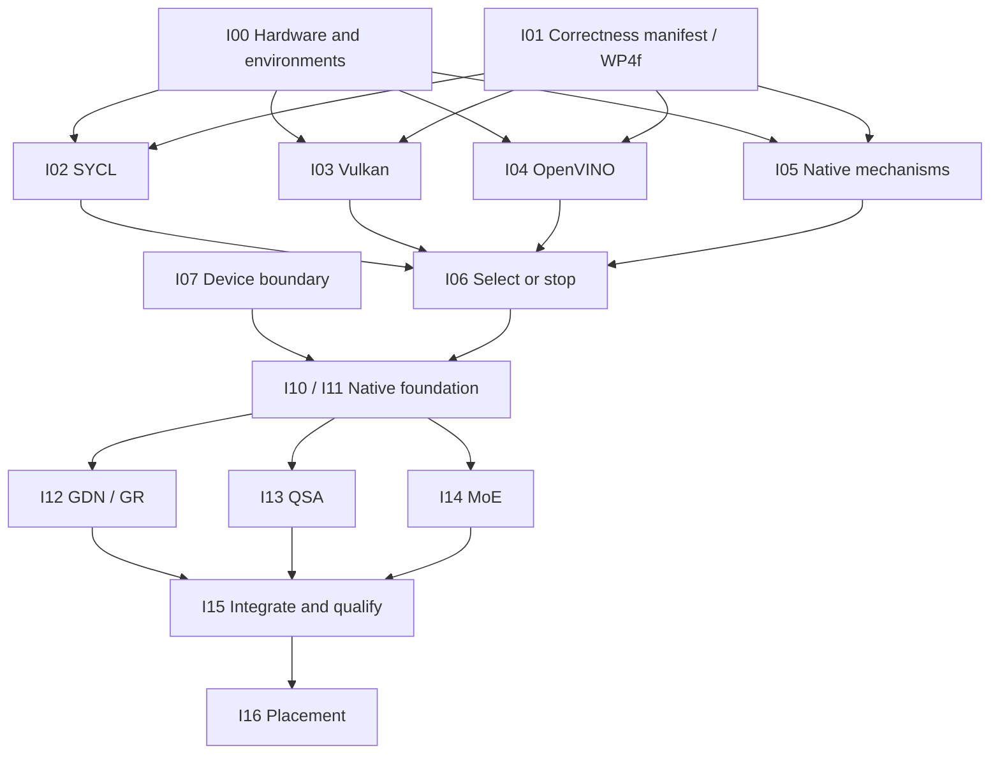

# Intel iGPU and backend restructuring work packages

Date: 2026-09-08. **Planned work, not implementation status.**
User priority: interactive inference first, training later.
Read [the platform research and design](INTEL_IGPU_BACKEND_DESIGN.md) for evidence, architecture,
ownership, benchmark protocol and selection criteria.

## Scope and execution rules

The deliverable is a measured decision and, only if justified, a useful Intel inference path with
maintainable backend boundaries. OpenVINO, SYCL and Vulkan receive support/correctness gates before
performance comparisons. No commitment to implement all three native backends.

Code preparation can run in parallel; **hardware measurements on this laptop are serialized**.
Check [ACTIVE_WORK_LOG.md](ACTIVE_WORK_LOG.md) before touching shared files or consuming the CPU/GPU.
Claude's WP4f fidelity work owns the current oracle. Freeze a corrected revision rather than changing
its transplant or reference harness from a second track.

Each package gets its own result/report directory and explicit file ownership. In the shared working
tree, one integration owner edits root CMake, generated-config emitters and public headers. Other
tracks prepare concrete changes to their own leaf directories; do not concurrently patch a monolith.
Keep downloads, SDK staging, model conversion and output in isolated paths. Never regenerate the
tokenizer/corpus or overwrite live WP4 artifacts as part of a backend experiment.

Effort bands below are **planning estimates**, not commitments: S roughly 0.5–2 engineer-days,
M 2–5, L 5–10, XL requires a new estimate after the preceding gate. Device/compiler problems and
reference-fidelity defects can dominate these estimates. Do not sum all conditional branches as an
approved project estimate.

## Package map

| ID | Deliverable | Dependencies | Estimate | Can prepare while WP4f runs? |
|---|---|---|---|---|
| I00 | Hardware/runtime inventory and reproducible environments | None | S | Yes, read-only inventory; schedule device probes |
| I01 | Artifact/operator census and correctness manifest | WP4f for final golden values | M | Yes, schema/fixture inventory |
| I02 | llama.cpp SYCL comparison | I00, I01 for exact target | M | Yes, isolated source/build preparation |
| I03 | llama.cpp Vulkan comparison | I00, I01 for exact target | M | Yes, isolated source/build preparation |
| I04 | OpenVINO feasibility and comparison | I00, I01 for exact target | M, bounded | Yes, support/export analysis |
| I05 | Native Intel mechanism experiment | I00, component fixtures in I01 | M | Yes, engine-free source preparation |
| I06 | Measured platform decision | I02–I05 | S | Report/harness preparation only |
| I07 | Canonical device ABI/build selection completion | Stable source checkpoint, I01 | M | Design/caller inventory only |
| I08 | CPU backend extraction | WP4f stable; baseline frozen | M | Mapping only |
| I09 | CUDA backend extraction | CUDA baseline frozen; coordinate I07 | L | Mapping only |
| I10 | Encoded-weight preparation and memory plan | I01, I06 selects native route, I07 | L | Descriptor/census design only |
| I11 | Native context and dense inference foundation | I06 selects native route, I07 | L | Design only |
| I12 | GDN and gated-residual device path | I11, I01 | L | Fixture review / experiment preparation |
| I13 | QSA device path | I11, I01 | L | Fixture review / experiment preparation |
| I14 | Encoded MoE device path | I10, I11 | L | Quant-format analysis |
| I15 | Integrated prefill/decode and qualification | I10–I14; I08 where needed | L | Consumer/benchmark design |
| I16 | CPU/iGPU/NVIDIA placement experiment | I15 or working external equivalent | XL | Cost-model design only |
| I17 | Full-model feasibility, PLE and later training | Separate gates below | XL | Inventory only; not first milestone |

I07–I09 are independently useful maintenance work. **I08/I09 are not prerequisites for I02–I06**,
and finishing every CUDA extraction is not a prerequisite for Intel inference. If OpenVINO or Vulkan
wins, revise I10–I15 around that actual implementation before authoring native code.

## Wave 1: establish evidence without engine changes

### I00 — Hardware and environment facts

**Owns:** a new `tools/intel_probe/` standalone probe if needed, `scripts/intel/` environment manifests,
and `out/intel-review/inventory/`. No production CMake/configuration mutation.

**Work:** verify adapter identity from runtime enumeration (registry found `8086:7D67`, driver
`32.0.101.8991`); deduplicate OpenCL/Level Zero views of the same device; record OS, RAM configuration,
power mode, driver, compiler, runtime versions, precision/subgroup/matrix capabilities and allocation
limits. Record the NVIDIA comparison device separately. Establish pinned isolated builds for each
contender and distinguish installed packages from this shell's PATH.

**Done when:** exact GPU execution is demonstrated by a checked operation, not just enumeration;
manifest identifies the runtime device and driver; a bounded allocation/transfer probe reports unique
host/shared/dedicated usage. Collect sustainable bandwidth and dispatch latency only in reserved
benchmark time. Report missing tooling as missing, not as unsupported hardware. Any changed environment
gets a new manifest. No driver update is required merely because a newer one exists.

### I01 — One artifact census and correctness manifest

**Owns:** `tests/fixtures/intel/` manifests and `scripts/intel/` comparison specifications; existing
fixtures and WP4 tools are read-only inputs.

**Work:** enumerate every tensor and op for the corrected four-layer prefix, its dense/sidecar files,
and intended full decoder. Record source/build hashes, generated config, all fingerprints, tokenizer
identity, token IDs, state formats, missing PLE/vision/MTP and each plane's actual quant type. Include
GDN unequal heads, Q width != hidden width, GR exit, QSA tail/indexer, MoE selected/shared experts.

**Done when:** a machine-readable manifest gives each backend a coverage row by **op, shape, dtype,
and phase**; reference fixtures carry origin, checksum, precision and tolerances. Final prefix goldens
depend on WP4f completion. Small real-vocabulary and exact-head-geometry cases exist. Required-fixture
absence exits nonzero. A four-layer prefix is never scored as a full-model language-quality result.

### I02 — llama.cpp SYCL

**Owns:** `scripts/intel/sycl/`, `out/intel-review/sycl/`; a separate upstream checkout, not Claude's.

**Work:** pin a source revision that recognizes the actual preview; build the documented Windows
route in FP32 and FP16 variants. First run a small supported Qwen control, then component/prefix gates.
Check oneDNN/custom GEMV selection and Level Zero versus OpenCL only where the driver exposes them.
Inspect actual op placement, encoded types, recurrent-state handling and fallback before timing.

**Done when:** I01 checks pass or exact unsupported cases are documented; runs reproduce from the
manifest; TTFT/decode/memory data follow the design protocol. Unexpected CPU execution is a failed
all-iGPU gate; intentional mixed execution is a separately labeled result. No global claim that
the SYCL compiler guarantees full model support.

### I03 — llama.cpp Vulkan

**Owns:** `scripts/intel/vulkan/`, `out/intel-review/vulkan/`, separate upstream build output.

**Work:** use the same upstream revision as I02 where possible, exact GPU selection, artifact and
token stream. Exercise GDN/indexer/quant constraints and repeated requests. Query shader features;
do not assume cooperative-matrix acceleration is available on this adapter.

**Done when:** the same correctness and timing record as I02 is produced, with shader compiler and
driver identified. Any revision mismatch with SYCL is explicit. Include observed CPU fallbacks and
allocated memory; no conclusion based solely on an ordinary dense model or a shader compiling.

### I04 — OpenVINO: two feasibility routes

**Owns:** `scripts/intel/openvino/`, `out/intel-review/openvino/` and any small export experiment there.

**Work:** separately test (a) llama.cpp OpenVINO on GGUF and (b) native Runtime/GenAI export or direct
model ingestion. Audit exact `qwen4_exp` topology, GDN cache/reset, QSA selection and all IQ types.
The fetched llama.cpp adapter omits the sidecar's three IQ formats; reproduce and name the first real
unsupported boundary. Use a small supported model to establish the stack independently of this gap.

Bound the first pass to **two engineer-days after environment setup**. If the target requires custom
ops or conversion, produce a concrete minimal graph, unsupported-node list, proposed GPU implementation
and peak conversion/resident-memory budget. Avoid converting the full 125B artifact just to discover an
unsupported operator. Identify source/converted precision separately and validate any changed weights.

**Done when:** each route is classified runnable / requires bounded custom work / not suitable at this
milestone, with reproduction evidence. Eligible routes receive comparable timing. A native OpenVINO win
must include its graph preparation and weight representation; adapter-specific limitations must not be
incorrectly generalized to the whole toolkit. Missing coverage is a decision input, not an open-ended
porting assignment hidden in a benchmark ticket.

### I05 — Small native Intel mechanism experiment

**Owns:** `benchmarks/intel/` standalone sources and `out/intel-review/native-probe/`. Separate CMake
entry for the experiment; no production CLI flags.

**Work:** compare oneDNN/oneMKL dense projection against a simple checked SYCL kernel at M=1 and
prefill M=32/128; use D_MODEL=2560, Q/gate widths from layout, FF=640, real GDN head geometry. Add one
GDN recurrent step and one selected expert triple from actual encoded weights. Compare direct encoded
dot versus bounded f16/f32 resolve, including transfer/pack cost. A small fixed sequence of dependent
kernels measures launch/synchronization overhead that an isolated GEMM misses.

**Done when:** correctness, bytes, first-call/setup and warmed latency are reported; application-owned
storage is reserved before execution and all hidden library allocations are measured where possible.
No hard-coded XMX path without a capability check. State clearly whether the probe proves only kernel
viability. Retire its duplicate scaffolding behind the existing benchmark option after findings enter
the chosen backend, per AGENTS §11.

### I06 — Platform decision record

**Owns:** a result appendix to the design doc and raw-result manifest index.

**Work:** compare feasible routes at batch one, warm TTFT and p50/p95 decode latency, preparation time,
correctness, peak memory, fallback, and available energy data. Include CPU and eligible NVIDIA results.
Use interleaved isolated trials. Apply the provisional 20%/5% promotion criteria from the design as an
investment aid; show separate prompt-length outcomes rather than burying them in one score.

**Done when:** choose one of: native SYCL investment, native Vulkan investment, OpenVINO integration,
external-runtime integration, or stop Intel port work because it does not improve the use case.
Document excluded candidates and why. If only a component works, approve at most the next component
milestone, not full-backend delivery. Newer releases can reopen a failed route with new evidence.

## Wave 2: independently useful restructuring

### I07 — Finish the existing device boundary and build axis

Split delivery into I07a (CUDA symbol/consumer cleanup and contract checks) and I07b (second toolchain
and device selection, landing with I11's real target). I11 depends on I07a; I07b and I11 are one
integration change. This avoids a dependency cycle and speculative build options.

**Owns:** `include/sub0/device_backend.hpp`, backend production exports, `cmake/Backends.cmake`,
`cmake/SuperBuild.cmake`, root CMake, `tools/configurator.cpp` and build-facts generation. One owner.

**Work:** enumerate production and diagnostic consumers; make CUDA implement the neutral exports
natively and remove the inline vendor bridge. Keep backend-specific diagnostic hooks, but do not move
them ahead of the private context/state contract in I09. Add an ABI version/size handshake only with
its setup reader, keeping existing on-disk formats untouched. Preserve CPU-only stubs, mock evaluation,
capability-based fallback, current CUDA guards, and default selection. Bring the second device/toolchain
into CMake only when its real target exists; derive a neutral build fact without treating `HAS_CUDA` as
generic accelerator availability. SuperBuild has only a host child today: complete toolchain isolation
and generated-config identity checks rather than assuming it exists.

The ABI work must also define the boundary between legacy dense f32 parameter upload and future
artifact preparation. The latter needs versioned, size-tagged metadata for layout fingerprints, tensor
descriptors, precision, encoded ranges, packing identity, and memory categories. Capability bits alone
must not admit an artifact whose required operators or state are missing.

**Done when:** production code has no direct vendor exports; symbol inventory and CPU/CUDA/mock
unfiltered suites pass; a mismatched backend fails setup clearly. No Intel SDK is needed for default
builds. Both the configurator and build system agree on backend, model layout and capabilities.
No `HYBRID` flag is enabled without an actual scheduler. Coordinate export edits with I09.

### I08 — Split CPU responsibilities without changing behavior

**Owns:** `src/backends/cpu/backend.cpp` and new `src/backends/cpu/`; shared CMake changes queued through I07.

**Work:** establish a private `WorkerState`/graph contract first without changing ownership. Then
extract optimizer/reduction, private operators plus backward traversal, model/full-forward, and
decode/API at natural dependency boundaries. Keep the `Model` pointers into the owning worker state;
do not create a second layout or arena owner. Preserve decode caches as a separate reset lifetime.
Preserve pointer lifetimes, initialization order, SIMD pragmas, `if constexpr`, hot inlining, and all
model math. Keep TU-private helpers private; do not introduce a common polymorphic tensor class.
Separate B12 memory changes from the initial source movement so regressions can be localized.

**Done when:** every moved symbol has an inventoried consumer; default exact assertion counts and
hashes match before/after; realistic feature-on suites, WP4 fixtures and decode state checks pass.
Record compile time, binary size, peak memory and isolated latency at two scales. Investigate any
material regression; do not excuse it as the inherent cost of cleaner files. Public API/serialization
remain compatible. Do not start moves before the WP4f source checkpoint is stable.

### I09 — Split CUDA context, kernels, execution and diagnostics

**Owns:** `src/backends/cuda/backend.cu`, new `src/backends/cuda/`, private diagnostic declarations and CUDA tests.

**Work:** first create the private context/state contract while retaining the current global ownership
internally. Move stream/cuBLAS ownership, allocation registries, graph handles, and invalidation rules;
then move coherent kernel groups and launchers, followed by forward/decode/train/optimizer execution.
Move diagnostic exports only after a private diagnostic facade can consume those interfaces; diagnostics
must not force production globals into a public header. Keep template definitions near instantiation
and kernel launchers in suitable TUs. Determine whether device linking is actually needed; do not enable
relocatable-device-code globally by default. Keep captured graph addresses stable and error handling at
the C boundary.

The multi-source CMake target is part of this package: replace the single `backend_cuda.cu` source,
preserve the CUDA C++20 versus host C++26 boundary, and explicitly validate whether cross-TU device
linking is required. The first extraction must preserve the current no-RDC behavior unless a measured,
necessary split proves otherwise.

**Done when:** unchanged supported feature matrix, CPU/CUDA parity, full feature-on suite and exported
diagnostics. Add focused lifecycle checks for parameter upload after graph capture, optimizer-update
then decode, KV/session reset, binding replacement while graphs exist, scratch growth, and failed
partial allocation cleanup. Compare kernel register/spill data, launch geometry, graph capture/replay
and decode/training timings against the frozen baseline. Existing GR/MoE/QSA/head-width guards stay
until a separate correctly implemented path replaces them. This ticket is organization, not a CUDA
Qwen4 port.

## Wave 3: conditional native integration

### I10 — Weight preparation, packed derivatives and memory accounting

Coordinate internal context/descriptor contracts with I11. Keep experimental descriptors private;
publish the encoded-artifact entry point only with I15's actual encoded-model generation consumer.

**Owns:** selected backend `weights.*`, bounded internal artifact descriptors, relevant loader/memplan
integration. Reuse `moe_quant.hpp`, `gguf.hpp`, `PARAM_LAYOUT` and WP4e storage semantics.

**Work:** pass encoded expert ranges and dense weights without expanding all experts. Distinguish
borrowed mapping lifetime from copied/packed ownership; define alignment, shape/stride/encoding and
capacity checks. Select cache capacity at preparation, record source/packing identity and bound peak
temporary space. Make precision conversion explicit. Represent unique host/shared/dedicated bytes
without double-counting shared mappings. Include persistent state and library workspaces.

**Done when:** real mixed-plane fixtures match; preparation refuses malformed/incompatible ranges
before use; peak memory is measured at small and exact prefix scale. No per-token file read/allocation
is introduced in the resident mode. Mapped/tiered modes separately measure misses and stalls. Old model
and optimizer checkpoint byte layouts remain valid; no full model-sized staging copy is assumed.

### I11 — Context, dense kernels and an actual inference consumer

**Owns:** selected backend `context.*`, `kernels/linear.*`, normalization/elementwise helpers and `api.*`.

**Work:** implement the internal single-session lifecycle from the design, queue/event ownership,
scratch reservation, dense projection/norm/RoPE paths and failures. Keep FP32 correctness mode and
separately gated reduced precision. Wire a small supported dense model into the existing generation
consumer with explicit artifact validation; do not advertise Qwen4 while I12–I14 are missing.

**Done when:** a real generation request runs through the selected Intel backend, reset/second request
passes, allocation instrumentation covers first decode after prepare and warm decode, exceptions stay
inside the DLL, and default CPU behavior is unchanged. Missing architecture features reject setup
with a reason or select CPU before execution, never halfway through a stateful token.

### I12 — GDN and gated residual

**Owns:** Intel `kernels/gdn.*`, `kernels/gated_residual.*`, corresponding tests; shared wiring by I15.

**Work:** implement unequal-head GDN, causal convolution and persistent recurrent state; GR read/write
gates and exit collapse. Separate chunked prefill from recurrent decode. Begin with conservative state
precision, then measure fusion and reduced-precision projections. Reference actual formulas and axis
mapping, not analogies to other recurrent or hyper-connection models.

**Done when:** real fixtures, long repeated-token drift, reset, chunk-boundary and non-square/exact-head
cases pass before timing. Inference state stays on device; no hidden per-step allocation. The three-GDN
prefix integrates correctly with the same resident residual representation I13/I14 consume.

### I13 — QSA indexer and sparse attention

**Owns:** Intel `kernels/qsa.*`, QSA state/private descriptors and tests.

**Work:** partial RoPE, query/gate projection, pooled indexer keys, block selection/masking and gated
output at real D_Q/D_KV. Preserve incomplete-tail semantics. Use bounded scratch/chunks; identify any
full-sequence or dense attention allocation before introducing it. Sharing ordinary attention helpers
must not erase QSA behavior.

**Done when:** compare block selections, masks, attention output and persistent state at prefix lengths
around compression boundaries and selection-budget transitions. Small and real geometry pass;
memory scaling is reported. No claim that a generic lightning-indexer kernel proves the entire QSA op.

### I14 — Routed and shared experts

**Owns:** Intel `kernels/moe.*`, quantized dot/pack kernels and associated tests.

**Work:** router/top-k/normalization, shared expert, grouped routed work and mixture accumulation.
Benchmark each actually used IQ format. Prefer bounded direct or tiled dequant-dot over complete
expert expansion where it wins; model cache eviction and multiple expert selections deterministically.
No conversion of all planes to a conveniently supported dtype merely to avoid type dispatch.

**Done when:** real plane values and complete expert outputs pass, including routing ties/extremes,
mixed encodings, cold/warm cache and repeated experts across prefill tokens. Report selected-expert
bytes read, dequantization/packing time, GEMV/GEMM time, and end-to-end block latency. A new cache or
packed representation is gated by capacity and quality, not just peak compute throughput.

### I15 — Integrated prefill, decode and acceptance

**Owns:** selected backend `prefill.*`/`decode.*`, `include/sub0/decode.hpp` integration, new interface
consumers, relevant stage setup and test/benchmark registration. Own shared wiring for I12–I14.

**Work:** reserve/reset all state together; add chunk prefill with absolute positions and final-logits
return; retain single-token logits for the current CPU sampler and callbacks. Bring up the complete
corrected four-layer artifact. Validate model and backend ABI identity before execution. Stop on a
device fault; CPU recovery requires an explicit reset/replay, not stale cache continuation.

**Done when:** I01 prefix fidelity, full enabled suites, default suite count comparison, prompt/decode
equivalence, second-session reset and context-limit checks pass. No project-owned hot allocation;
record observed runtime allocations. I06 metrics improve on the chosen comparator at exact scale,
including preparation/peak memory. The report states excluded PLE/vision/MTP and does not label the
prefix a useful full model. Runtime/toolchain redistributables and clean-shell startup are verified.

## Later, separately gated work

### I16 — CPU/iGPU/NVIDIA placement

Start only with a correct single-device chain or an external runtime already capable of the same
experiment. Compare entire blocks, MoE expert partitioning, and prefill/decode placement separately.
Account for dependency order, shared DRAM bandwidth, host staging between vendors, queue waits,
package-power contention and all recurrent-state transfer. A whole-model iGPU win is not required
for a useful assist, but each assist must shorten the real critical path.

**Done when:** repeated batch-one latency improves after every transfer and synchronization cost,
accuracy/state continuity pass, and memory remains feasible. Encode a measured placement as a
build/setup plan. Do not export duplicate neutral symbols from two accelerator DLLs, invent a runtime
plugin registry, or enable the existing unimplemented HYBRID flag as a cosmetic milestone.
Merge capacity findings back into `QWEN4_MEMORY_ORCHESTRATION.md` rather than starting a second tier planner.

### I17 — Full decoder, optional sampling, and training follow-ups

These are separate gates, not one deliverable:

- **Complete useful model:** re-evaluate capacity for an actual full artifact, complete PLE/n-gram
  integration through existing Sub0Firn work, and validate tokenizer/chat-template and outputs.
  Reducing layers or dropping PLE is not completion. New smaller Qwen4 releases require a new census.
- **Device sampling:** only if vocab-logit copy/CPU sampling is measured to matter. Preserve callback,
  RNG/distribution and diagnostic contracts or expose an explicitly different mode. Relates to B13.
- **Vision/MTP/NPU:** each needs its own real operator and memory study; useful later, not implied by
  text-prefix success. Speculative decode needs state rollback/snapshots beyond ordinary reset.
- **Training/fine-tuning:** user explicitly put it later. Requires backward coverage, mutable weights,
  optimizer ownership/checkpoint parity and realistic memory feasibility. OpenVINO inference support
  does not supply these. Separate host optimizer settings from storage to avoid reserving unnecessary
  CPU Muon buffers for device-only work; relates to the recorded Muon memory follow-up.

## Suggested parallel assignment

For a four-person/agent wave: one owner handles I00/I01 and measurement integration; three independent
lanes prepare SYCL, Vulkan and OpenVINO. I05 follows the first usable Intel environment. They exchange
manifests/results, not edits to WP4 code. Benchmarks use a shared time reservation, not simultaneous
execution. No agents were launched during this design pass.

After I06: one integration owner handles I07/I10/I11, with CPU and CUDA extractions independently
scheduled after baselines stabilize. Once the native foundation contracts are fixed, GDN/GR, QSA and
MoE can be authored concurrently in separate files. The integration owner merges the execution chain
and conducts the serialized acceptance run.

## Relationship to the independent backlog

| Existing item | Intel work relationship |
|---|---|
| B06 load-state validation | I10/I15 must not publish partially prepared device state; coordinate persistence fixes |
| B08 trustworthy tests | I01/I06 require mandatory fixtures, truthful skips and failure exit status |
| B09 provenance | I00/I07/I10 need exact binary/config/packing identity; reuse the provenance work |
| B10 documentation | I07–I09 update stale backend/superbuild comments as their behavior is verified |
| B12 CPU forward-only arenas | Separate measurable follow-up to I08; useful for CPU fallback and host headroom |
| B13 sampling | I17 only after profiling; no automatic device-sampling redesign |
| B14 Muon | Already implemented; later training may separate settings from host scratch ownership |
| B15 CPU scheduling | Input to I16 contention studies, not a prerequisite for basic iGPU execution |
| B16 prefill | I15 owns the Intel chunk-prefill consumer; coordinate CPU prefill work to avoid duplicate APIs |
| B18 ownership | I07/I11 session contract; no premature multi-model serving framework |

First action when implementation resumes: **I00 + I01 preparation**, then the three external comparison
lanes. No native full-backend commitment until I06. Preserve the user's tokenizer document and all
uncommitted Muon changes throughout.
